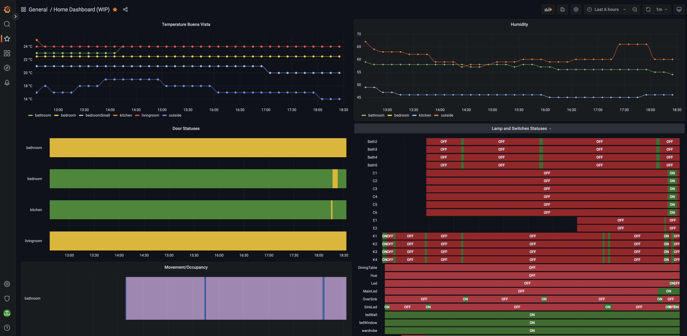

# HomeKit data to InfluxDB visualized in Grafana
Homekit data ingestion in InfluxDB and visualisation in Grafana

# How to setup InfluxDB, Grafana and Homekit .

### Prerequisites: 

###  You need a linux machine(VM, raspberry pi,etc), SSL certificate (not self signed)

I have homebridge image installed on Raspberry PI4, you can install stardart debian, or rasbian, you should be able to install docker :)  

## Lets START: 

Install Docker and Portainer ,  you can watch this amazing guide https://www.youtube.com/watch?v=kykvC2cGlNQ&t=0s  and you can use part of his scripts to easy install what you need.

Connect to SSH to your linux machine and run : 


`curl -sk https://raw.githubusercontent.com/rionshin/HomeKitInfluxGrafana/main/InstallDocker_Portainer | sudo bash - `

Go to http://IP:9000 to connect to Portainer and setup your user/pass on 1st login. 

Install docker compose: 
``` 
sudo apt-get update
sudo apt-get install docker-compose-plugin 
docker compose version
```
Create a folder in your Home(or wherever you want) - I created /home/pi/influx where you need to place telegraf.comf and docker-compose.yaml 
go to the folder you created and run:
` docker compose up -d`  

This will create dockers for  Telegraf, Grafana and InfluxDB - please note as I am using 32 image of rasbian os I installed influxDB v1.8 and not 2.0+

If you need guide how to easily install InfluxDB v2+ you can check this guide: https://www.youtube.com/watch?v=QGG_76OmRnA   

You can verify the docker is up, by opening your Portainer and checking the new docker containers or runnning  ` docker container ps `

For some strange reason when I created the dockers, users and password was not enforced on InfluxDB  ,so if needed :

Open portainer , select the InfluxDB container and go to console and run : 
` influx ` 
```
CREATE USER username WITH PASSWORD 'password' WITH ALL PRIVILEGES  
```
Check DB or create new with:
```
command : show databases
result: 
name: databases
name
internal
Homekit
command: show users
results:
user    admin
admin   true
homekit true
command: CREATE DATABASE "DN-NAME" WITH DURATION 1000d REPLICATION 1 
Duration is really important as this is the duration data will be kept before InfluxDB delete it. 
```
* More info on DB creation and management here : https://docs.influxdata.com/influxdb/v1.8/query_language/manage-database/#create-database 
* More info here: https://docs.influxdata.com/influxdb/v1.8/administration/authentication_and_authorization/#user-management-commands 
* Then you need to change your config file to have Auth Enabled. This can be done again in portainer console.  
* You need to install VI or NANO (`sudo apt update and then sudo apt install nano`).
```
Open config file located in /etc/influxdb/
root@ :/# cd /etc/influxdb/
root@ :/etc/influxdb# nano influxdb.conf   
```
and then edit the config and add following lines on the bottom:
```
[http]

  enabled = true

  bind-address = ":8086"

  auth-enabled = true
```
Going forward when you connect to your influxdb via console the command will be:

`influx -username USER -password PASS`

## Homekit can connect only to valid SSL addresses for that reason you need SSL certificate and ofcourse valid IP and FQDN. 

Configure your DNS A record to map to your IP where your machine is located, 
you can map it to your router IP and then portforwarding to your internal machine with Influx, etc. 

Go and get SSL certificate , it is really cheap - around 10$ per year. 

You can setup the SSL to your Influx instance, however as i already have NGINX installed I created proxy in NGINX that forward   port 8087 with enabled SSL to   8086 where is influx instance with no ssl. 

The config file is located in the repository named as : ` nginx-influxproxy.local `

### Please dont forget to create port mapping on your router for all ports you are using as they need to be reachable from outside. 

If you dont have NGINX installed you can watch any guide or read this article
` https://www.supereasy.com/how-to-configure-nginx-as-a-https-reverse-proxy-easily/ `

With all this setup and installed you now have linux instace with running dockers for InfluxDB, Grafana, Telegraf, you have NGINX web server with SSL proxy to forward 8087 to 8086 , and your router/network is setup so your device is visible outside on ports needed.  

## Now the fun part - Setting up the Homekit. 

I suggest to create a file `(my example: homekit.conf)` where you will place your connection string to Influx
` https://FQDN:8087/write?db=Homekit&u=user&p=password  NOTE: db=Homekit is the name of the database we created in Influx`

and you will create a structure how the data coming from Homekit want to looks like. 

My approach is the following based on InfluxDB capabilities
```
Homekit,room=bathroom,device=DoorSensor state="Open"
Measurement,room tag,device tag  Value
Homekit,room=bathroom,device=Light,name=Led status=1
Measurement,room tag,device tag,name tag Value
```
Measurement is the same as Table name in MS SQL for example, TAGs are columns, and Value is the column containing the value for this tags (boolean, float, string)
Please note that you cannot place different formats in Value columns, 
if the column is created as float - you inserted a number then you cannot insert a string. 

It is really important to keep attention on the synthax you dont have spaces between tags, and you have space and no `,` before Value. 
When you entering digits/boolean no need to put `" "` , you must use `" "` for string values. 

Now when you have your strategy for data formating we need to decide what data will consumer and how/when , and I come with following:
* for all temperature sensors, thermostats and slow changing states I use Timer on every 5min to trigger collection of data and send it to InfluxAPI
* for all lights and switches as I dont really care for exact time when I turn it on, I use again time that collect light and switch statuses every 2 min. 
* for all security sensors as door contacts, motion sensors, gas detectors , smoke detectors I use when device is triggered even to write to influxdb

You can use combination of this and it is important to note that for Timers there are 2 options:
* using EVE app timer (which i dont  like)
* use Homebridge plugin as Homebridge-Sheduler or homebridge-dummyswitch. I use Sscheduler and create few different switches which turn on/off on every 2,3,5min and i use them as event trigger for writing to influx.
* The homebridge plugin: ` https://github.com/kbrashears5/typescript-homebridge-schedule#readme `

## Lest go to Home app and create data collection for temperature and humidity sensors 

Open home app , new automation and select how automation will be triggered : 
* in my scenario i am using DummySwitch and event is when Switch is ON 
* then you need to select accessorie to control but you scroll down and select convert to shortcut  
* in shortcut view you will use few main elements: 
```
* Get the State of Home
* Round 
* Combine text
* Get Content of URL 
```
* We are preparing as much GET we need, which must be followed by round number to ones place 
* When you get all measures you need you are creating Combine text containing:
```
Homekit,room=kitchen,device=TempSensor temperature={YOUR VARIABLE FROM ROUND KITCHEN TEMP}
Homekit,room=kitchen,device=TempSensor humidity={YOUR VARIABLE FROM ROUND KITCHEN HUMIDITY}
Homekit,room=bedroom,device=TempSensor temperature=...
Homekit,room=bedroom,device=TempSensor humidity=...
Homekit,room=bathroom,device=TempSensor temperature=...
Homekit,room=bathroom,device=TempSensor humidity=...
Last option on combine must be selected: NEW LINES : all combined text -  each on new line. 
```
* now we need to prepare to send - place GET Content of URL and on URL place the influxDB url we prepared in homekit.conf 
`https://FQDN:8087/write?db=Homekit&u=user&p=password`

` Select POST method`

` Select request body - File`

`and for file select the Variable for Combined text`

* execute the shortcit and check your Influxlogs in Portainer - InfluxDB - Logs. They should looks like code below, code 204 mean POST was ok,  any other code is error: 

` [httpd] 192.168.1.1,192.168.1.44 - homekit [11/Oct/2022:15:26:28 +0000] "POST /write?db=Homekit&p=%5BREDACTED%5D&u=homekit HTTP/1.0" 204 0 "-" "BackgroundShortcutRunner/1184.1 CFNetwork/1391.3 Darwin/22.0.0" 13c3524c-4979-11ed-9ce4-0242ac180002 4670 `

* You can find a video of the setup to easily understand it. : ShortcutSetupHomekit.mp4 in the repo

## We can use the same approach to log Lights and Switches statuses. 

The trick here is that Get content of Device - Power state - may return different values, Some devices return 1/0, some Yes/No. 
And Homekit shortcut is not clever enough to set it all as boolean so you need to decide on approach: 
* Do you want to convert it to 1/0 or Yes/No => I selected to use 1/0
* you can check the SwitchState.png - using if statement to check is On and replace it with 1, otherwise replace with 0. 
* Same logic as above for some lights which return Yes/No
* You can check what your accessory return by open Shortcut app, select personal Shortcut and then create simple shortcut with Get Status of the accessory and run it. 
* for Switch and Lights I added one more tag Name 
```
Homekit,room=livingroom,device=Switch,name=TV status=
Homekit,room=livingroom,device=Light,name=wardrobe status=
```
### Tricks for some sensors as Light 

* Light sensor return measure in format Number lx , so when you get it you need to isolate only the number 
`check LightSensor.png`
* Use "Get Number from" - this will provide you number value you can use to send to InfluxDB. 
* if you dont know what your sensor return always check it, homekit will not give you an error if output for example is Text and you use Round or Get number, it will just return 0. 
* Write statement may give you error if you push text in float field, but as we use mostly Round and Get number it always convert it. 
* I would recomend when you select your variable also to select format Number. 

### Logging Security event 

* if you already have automation based on security events you can edit it and add on the bottom of the shortcut: 
* structure it with Combine text - its mandatory to use Combine Text so you can expose it in POST command
`You dont need to get status of the device as you already know it and can hardcode it` 
* GET content of URL and send the data to InfluxDB

For example: 
` On Door Open Create Shortcut and Combine text with: Homekit,room=kitchen,device=DoorSensor state="Open" ` 

Then 
 `Get Content of URL and POST the Combined text`

* Please note for Door Sensors you need to have 2 automations one for open and one for closed : DoorSensors.png  . 
* Same logic applies for Motion Sensors, as many of us have automations on detect motion and stop detecting motion you can add the Combine and POST on the botton of the shortcut - check `movementsensor.png` 
* for motion sensor I recomend this amazing guide which I use to stop my lights on stop detecting motion: 
https://homekitautomationtips.com/how-to-use-a-motion-sensor-to-turn-your-lights-off-with-homekit-but-giving-you-a-warning-first-more-advanced-version/ 

### You can use any of the approaches above to log your data or combine it, you will need write more shortcuts.  Its up to you to decide what will be your strategy. 

## Shortcut and Data Validation 

* When you create shortcut always use Play button to test it and check your logs in Portainer for Influxdb - if you see code 400 something is wrong, you can use CURL to execute same comand in command promt to see what will happen. POST example with CURL :

` curl -i -XPOST 'http://ip:8087/write?db=DBNAME&u=UserName&p=Password' --data-binary  'Homekit,room=bathroom occupancy=1' `

This is  the expected outcome with code 204 

```
HTTP/1.1 204 No Content
Content-Type: application/json
Request-Id: da689211-49fd-11ed-a344-0242ac180002
X-Influxdb-Build: OSS
X-Influxdb-Version: 1.8.4
X-Request-Id: da689211-49fd-11ed-a344-0242ac180002
Date: Wed, 12 Oct 2022 07:16:56 GMT
```
* You can also have open console to InfluxDB - Portainer --> InfluxDB -> Console and connect with

`influx -username USERNAME -password PASSWORD`

Then 

`use DBNAME`

and

`select * from Homekit` `NOTE: DB name is case sensitive`

* Check example in influxConse.png

You can easily check your fields and their format by using `show field keys`  or tags `show tag keys`

* Check the InfluxDB guide and DB Schema https://docs.influxdata.com/influxdb/v1.8/query_language/explore-schema/ 


# Grafana! 


Now when we have all the data in Influx we can start using Grafana. 


 

# To be continued.... 
 